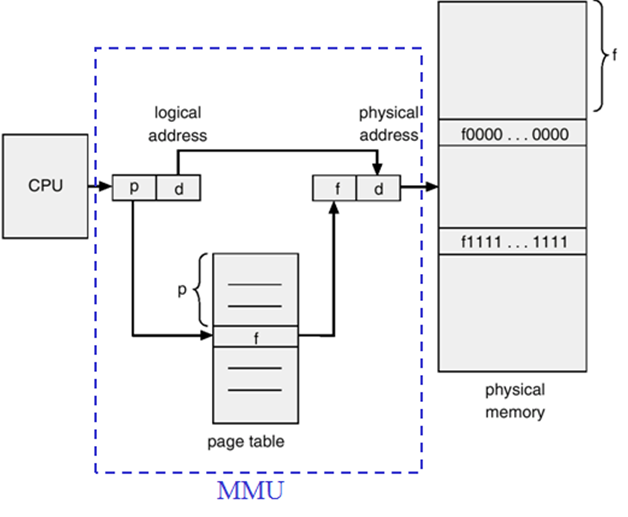
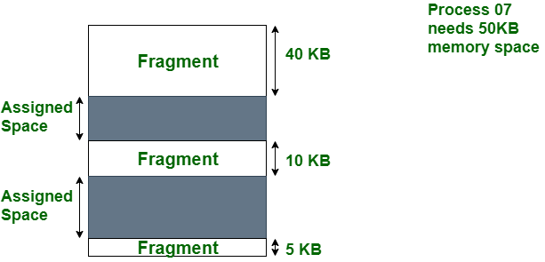
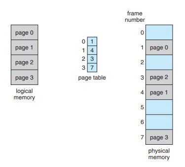
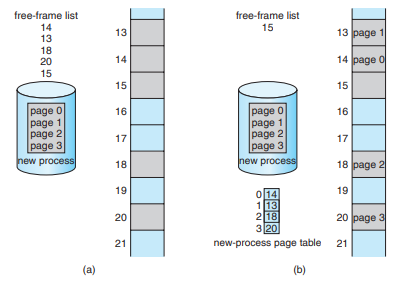
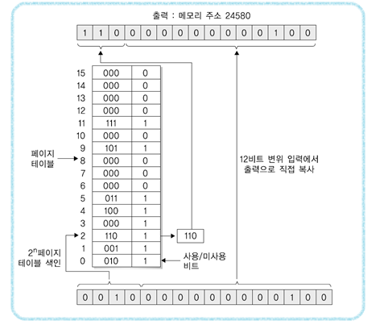
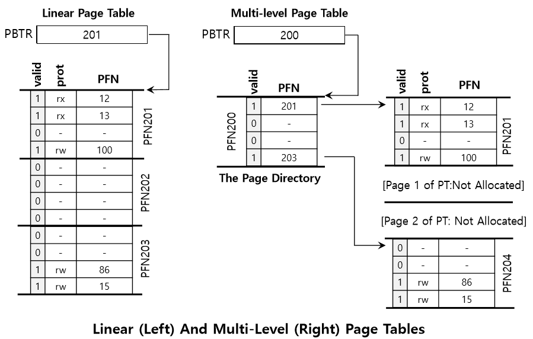
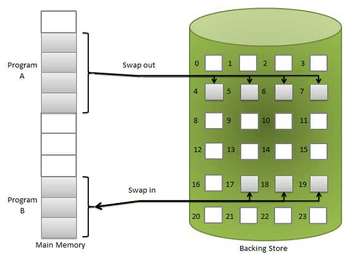
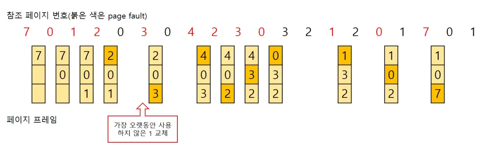

# Virtual Memory

<html>

<head>
<meta http-equiv=Content-Type content="text/html; charset=utf-8">
<meta name=Generator content="Microsoft Word 15 (filtered)">
</head>

&nbsp;

<h2><a name="_Toc122163610"><b>Virtual
memory</b></a></h2>

&nbsp;

프로그램이 실행되려면 먼저 운영체제로부터 RAM 주소를 할당 받아 데이터를 옮겨야 한다. 이때 만약 운영체제가 RAM의 실제 주소를 건네 준다면 다른 프로세스가 주소 영역을 침범하여 데이터가
변질되거나, 다른 악성 프로세스가 사용자의 데이터를 손쉽게 들여다 볼 수
있게 될 것이다. 또한, 프로그램 개발자는 실행될 때마다 달라지는 RAM 주소를 고려하여 프로그램을 짜야 한다. 이러한 상황을 방지하기 위해 모든 프로세스는 시작과 끝 주소가 같은 가상
주소를 할당 받게 된다. 가상 주소는 각자 다른 물리 주소에 매핑 됨으로써 여러 프로세스가
같은 가상 주소에 접근해도 모두 다른 물리 주소를 참조하게 하여 주소 충돌을 막아 안정성과 생산성을 높일 수 있게 된다. 물리 주소를 가상 주소로 매핑하거나, 가상 주소를 물리 주소로 변환하는 역할은 Memory Management Unit(MMU)이 맡는다. 

&nbsp;

↑ MMU가 가상 주소를 물리 주소로 변환한다.<a href="#_edn1"
name="_ednref1" title="">[i]</a>(네이버 블로그, n.d.)

&nbsp;

CPU는
물리 주소를 직접 다루지 않고 항상 가상 주소로 작업을 수행하게 된다. MMU는
CPU와 메모리 사이에 위치하여 CPU가 가상 주소에 접근해야 할 경우 MMU가 CPU로부터 가상 주소를 건네 받아 물리 주소로 변환한다. 캐시 메모리도 마찬가지로 MMU로부터 전달받은 물리 주소로 데이터를 다루게 된다.

가상 메모리 기법에는 대표적으로 초기에 사용되었던 Base&amp;Bound(B&amp;B) 기법과 현대에 사용되는 페이징 기법이 존재한다. 본 과제에서는 페이징 기법을 사용하여 가상 메모리를 구현하였다.

&nbsp;

<h2><a name="_Toc122163611"><b>Paging</b></a></h2>

&nbsp;

페이징은 가상 메모리 기법 중 하나로, 주 메모리를 같은 크기의 여러 프레임으로 나누고 가상 메모리를 같은 크기의 페이지로 나누어 관리하는 방법이다. 프로세스는 Process Control Block(PCB) 안에 페이지 테이블을 사용하여 자신에게 할당된 페이지들을 관리한다. 페이징의 장점은 초기 가상 메모리 기법인 B&amp;B가 연속적인 물리 주소 매핑으로 인한 외부 파편화의 발생으로 사용하지 못하는
공간이 생겼던 것과 다르게, 프레임과 페이지 단위로 관리하는 페이징 기법은 파편화 되어있는
공간에도 가상 주소를 매핑할 수 있어 비연속적인 물리 주소를 연속적인 가상 주소로 활용할 수 있게 된다.

&nbsp;

↑ 외부 파편화에 의해 새로운 프로세스를 생성하지 못하는 경우<a
href="#_edn2" name="_ednref2" title="">[ii]</a>(GeeksforGeeks, n.d.)

&nbsp;

↑ 페이징 기법은 외부 파편화가 발생하지 않는다.<a href="#_edn3"
name="_ednref3" title="">[iii]</a>(Tistory, 2020)

&nbsp;

하지만 페이징 기법은 할당된 프레임의 일부분만 사용하는 내부 파편화가 발생 할 수 있다. 예를 들어 페이지 단위가 1024bytes일 때 어떤 프로세스가 1025bytes의 메모리가 필요하다면, 페이지를 2개 할당하여 총 2048bytes를 사용하게 된다. 1byte를 위해 1024bytes를 더 할당하게 되는 것이다. 페이지의 단위를 작게 하면 내부 파편화를 최소화 할 수 있지만, 그만큼 총 페이지 개수가 늘어남으로써 페이지 테이블 크기와 같은 오버헤드가 증가하게 되어 효율성이 떨어지게
된다. 이러한 특성을 고려하여 오늘날의 페이징 기법은 4KB에서 8KB의 페이지 단위를 사용한다.

&nbsp;

↑ 내부 파편화에 의해 프레임 내부에서 낭비되는 공간이 생긴다.<a
href="#_edn4" name="_ednref4" title="">[iv]</a>(GeeksforGeeks, n.d.)

&nbsp;

운영체제는 프로세스의 요청에 따라 페이지를 할당하기 위해 사용 가능한 주 메모리 프레임들을 관리해야 하고, 가상 주소를 물리 주소로 변환하기 위해 각 프로세스 PCB의 페이지 테이블을 갖고 있어야 한다.

&nbsp;

↑ 운영체제는 사용 가능한 프레임과 프로세스의 페이지 테이블을 관리한다.<a
href="#_edn5" name="_ednref5" title="">[v]</a>(Tistory, 2020)

&nbsp;

&nbsp;

<h3 style='margin-left:50.0pt;text-indent:-20.0pt'><a name="_Toc122163612"><b>Page Table</b></a></h3>

&nbsp;

페이징 기법은 프로세스마다 하나씩 갖고 있는 페이지 테이블을 통해 가상 주소를 물리 주소를 변환한다. 페이지 테이블은 가상 주소의 상위 비트들을 인덱스로 사용하여 프레임 번호를 저장하는 자료 구조이다. 4GB
메모리를 갖고 페이지 크기가 4KB인 32비트 주소 체계를 예로 들면, 주소에서 상위 20개 비트(4GB / 4KB)를 페이지 테이블의 인덱스로 사용하여 프레임을 찾고, 하위 12개 비트(4KB)는 물리 주소의 오프셋으로 사용하여 물리 주소로 변환하게 된다. 이처럼 하나의 페이지 테이블을 사용해 물리 주소로 변환하는 기법을 One-level 페이징이라 한다.

&nbsp;

↑ 16비트 주소 체계에서 가상 주소를 물리 주소로 변환하는 과정<a href="#_edn6"
name="_ednref6" title="">[vi]</a>(Crocus, n.d.)

&nbsp;

페이지 테이블도 하나의 자료 구조 이므로 메모리에서 공간을
차지하게 된다. 예시로 사용한 32비트 주소 체계에서 페이지 테이블의 크기는 페이지 테이블 엔트리 개수 2^20에 4bytes(32비트)를 곱한 4MB가 된다. 현재 필자의 컴퓨터에서 600개
정도의 프로세스들이 실행 중인데,
이 프로세스들이 각각 4MB의 페이지 테이블을 갖고 있다면 총 페이지 테이블의 크기가 약 2.4GB에 달하게 된다. 게다가,
대부분의 프로세스는 페이지 테이블의
일부 엔트리만 사용하여 작업을 수행하지만,
이런 프로세스들에게도 4MB의 페이지 테이블 할당하는 것은 너무 많은 공간을 낭비하게 된다. 이러한 문제점을 해결하기 위해 Two-level 페이징이 고안되었다.

&nbsp;

<h3 style='margin-left:50.0pt;text-indent:-20.0pt'><a name="_Toc122163613"><b>Two-level paging</b></a></h3>

&nbsp;

Two-level 페이징은 전술한 One-level 페이징에서 페이지 테이블의 크기로 인해 낭비되는 메모리를 줄이기 위해 고안된 기법이다. 페이지 디렉토리 자료구조에 페이지 테이블을 할당하는 형태로, 비어 있는 엔트리는 페이지 테이블이 존재하지 않아 메모리를 차지하지 않는다. Page Table 목차에서 32비트 주소 체계를 다시 예시로 든다면, 주소에서 상위 10비트를 페이지 디렉토리의 인덱스로 사용하고 중앙의 10비트를 페이지 테이블 인덱스로, 하위 12비트는 그대로 오프셋으로 사용하는 것이다. 따라서 One-level 페이징에선 1KB의 메모리만을 사용하는 프로세스를 위해 4MB의 페이지 테이블이 필요했지만,
Two-level 페이징에선 페이지 디렉토리 크기 4KB, 페이지 테이블 1개 크기 4KB로 총 8KB만이 필요하게 된다.

&nbsp;

↑ 비어 있는 페이지 디렉토리 엔트리는 페이지 테이블이 존재하지 않으므로

메모리를 차지하지 않는다.<a href="#_edn7" name="_ednref7"
title="">[vii]</a>(Tistory,
2020)

&nbsp;

Two-level 페이징은 물리 주소로 변환할 때 추가적인 단계를 거치므로 One-level 페이징에 비해 오버헤드가 크다는 단점을 가지고 있다. 그럼에도 페이징에 필요한 자료 구조의 크기를 획기적으로 줄일 수 있다는 장점을 갖고 있어 오늘날 운영체제에서 Multi-level 페이징으로 단계를 더 추가하여 사용 중이다.

&nbsp;

&nbsp;

<h2><a name="_Toc122163614"><b>Memory
swapping</b></a></h2>

&nbsp;

주 메모리는 프로세스를 실행하기 위해 필수적인 자원이지만 용량이 한정되어 있다. 따라서 주 메모리만으로는 효율성에 한계가 존재하게 되는데, 이를 극복하기 위해 주 메모리를 HDD, SSD와 같은 용량이 큰 보조 메모리의 일부 영역과 함께 사용하는 기법인 메모리 스와핑이 고안되었다.

메모리 스와핑은 페이지를 주 메모리에서 보조 메모리로 옮기는 Swap-out과 보조 메모리에서 주 메모리로 옮기는 Swap-in 과정으로 이루어진다.

&nbsp;

                                   ↑ 메모리 스와핑<a href="#_edn8"
name="_ednref8" title="">[viii]</a>(Data Science Lab, 2015)

&nbsp;

주 메모리의 용량이 가득 찼을 때 페이지 교체 정책에 의해 몇몇 페이지들을 보조 메모리로 Swap-out 함으로써 프로세스를 종료하지 않고도 용량을 확보할 수 있게 된다. 또한, 프로세스가 CPU 자원을 할당 받았지만 주 메모리가 아닌 보조 메모리에 페이지가 존재할 경우 Page fault 인터럽트를 실행, 보조 메모리에서 해당 프로세스의 페이지들을 Swap-in 하여 계속 실행하게 된다.

Swap-out 할 페이지를 고르는 페이지 교체 정책에는 여러가지가 존재하는데, 그 중 대표적인 것으로 Least Recently Used(LRU) 알고리즘이 있다. LRU 알고리즘은 가장 오랫동안 참조되지 않은 페이지를 교체하는 정책으로, 많은 운영체제가 채택하고 있다.

&nbsp;

↑ LRU 알고리즘의 동작 방식<a href="#_edn9"
name="_ednref9" title="">[ix]</a>(Medium, 2019)

&nbsp;

&nbsp;

<h2><a name="_Toc122163616"><b>구현</b></a><b> </b><b>환경</b><b> </b><b>및</b><b> </b><b>실행</b><b> </b><b>방법</b></h2>

&nbsp;

운영체제 : macOS

언어 : C++14

컴파일러 : clang 14.0.0

Makefile 사용하여 컴파일 가능 (macOS)

※&nbsp;&nbsp;&nbsp;&nbsp;
Linux(assam 서버)의 경우 컴파일은 가능하지만 바르게 동작하지 않음

소스 파일 : Makefile, main.h, main.cpp, Scheduler.h,
Scheduler.cpp, Child.h, Child.cpp, FIFO.h, FIFO.cpp RR.h, RR.cpp, MLQ.h,
MLQ.cpp, MLFQ.h, MLFQ.cpp, CFS.h, CFS.cpp

실행 방법 : ./2022_os_proj2로 실행 후 사용자의 입력에 따른 스케줄러, 페이징 레벨로 실행

실행 완료 후 출력 파일 : &lt;스케줄러 이름&gt;_&lt;페이징 레벨&gt;_schedule_dump.txt

실행 시간 : 약 150초(50ms *
3000 tick)

</html>
